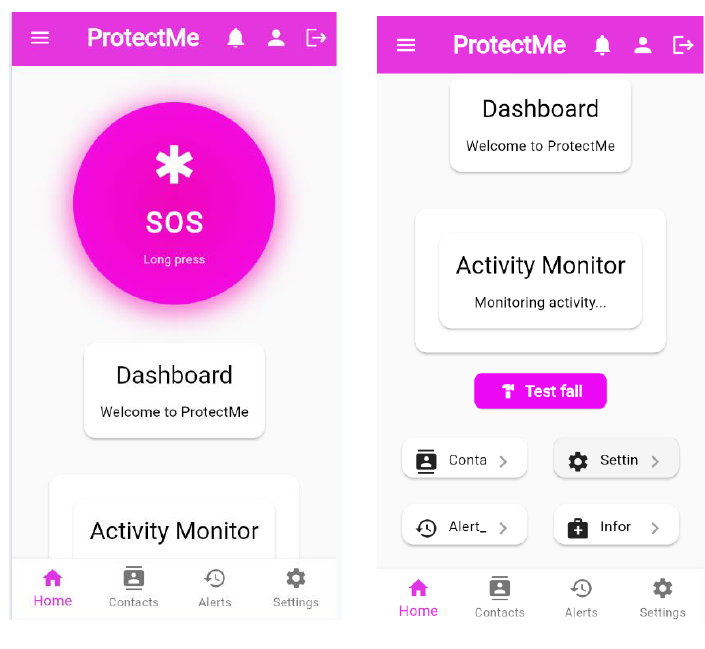
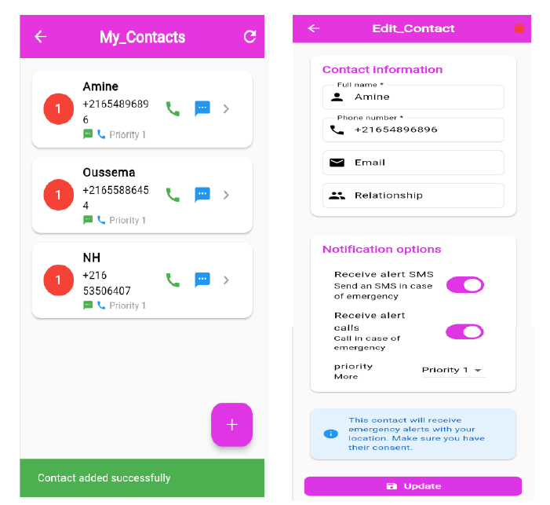
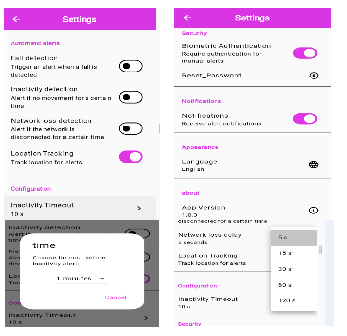

# 🛡️ ProtectMe – Application de sécurité personnelle

[](https://flutter.dev)
[](https://firebase.google.com)
[](https://www.tensorflow.org/lite)
[](LICENSE)

**ProtectMe** est une application mobile (Android) et web conçue pour assister les personnes isolées ou âgées en cas de situation d’urgence. Elle combine un **bouton SOS manuel** et une **surveillance automatique intelligente** (détection de chute, d’inactivité prolongée et de perte de réseau). Les alertes sont envoyées aux contacts d’urgence via **WhatsApp** (sur le web) ou **SMS** (sur mobile).


---

## ✨ Fonctionnalités principales

- 🔐 **Authentification** – Inscription / connexion sécurisée (Firebase Auth)
- 👥 **Gestion des contacts d’urgence** – Ajout, modification, suppression, priorité, activation des canaux (SMS / appel)
- 🆘 **Alerte SOS manuelle** – Appui long (2s) → confirmation → envoi de la position GPS
- 🧠 **Détection automatique de chute** – Modèle IA TensorFlow Lite (96,6 % de précision)
- 🕒 **Détection d’inactivité prolongée** – Analyse de l’accéléromètre, délai configurable (mode jour/nuit)
- 📡 **Détection de perte de réseau** – Alerte après un délai sans connexion
- 🔔 **Confirmation avant envoi** – Notification avec bouton “Annuler” (5 secondes)
- 📜 **Historique des alertes** – Liste avec carte de localisation
- ⚙️ **Paramètres** – Activation/désactivation des détections, réglage des délais, langue (fr/en/ar)
- 👑 **Interface administrateur** – Supervision des alertes, gestion des réclamations (Firebase)

---

## 🛠️ Technologies utilisées

| Catégorie          | Technologies                                                                 |
|--------------------|-------------------------------------------------------------------------------|
| **Frontend**       | Flutter (Dart), Provider (state management)                                  |
| **Backend**        | Firebase (Auth, Firestore, Storage)                                          |
| **IA & Capteurs**  | TensorFlow Lite, sensors_plus (accéléromètre/gyroscope), geolocator, connectivity_plus |
| **Notifications**  | flutter_local_notifications, url_launcher (WhatsApp/SMS)                     |
| **CI/CD**          | GitHub Actions, Docker                                                       |
| **Entraînement IA**| Python, TensorFlow, scikit‑learn, pandas, Jupyter Notebook                   |

---

## 📱 Captures d’écran

| Écran d’accueil | Gestion des contacts | Paramètres |
|----------------|----------------------|-------------|
|  |  |  |

*(Ajoutez ici vos propres captures dans le dossier `screenshots/`)*

---

## 🚀 Installation et exécution

### Prérequis
- [Flutter SDK](https://docs.flutter.dev/get-started/install) (≥3.10.7)
- [Android Studio](https://developer.android.com/studio) ou VS Code
- Un émulateur Android / périphérique réel ou un navigateur Chrome

### Étapes
1. **Cloner le dépôt**
   ```bash
   git clone https://github.com/HosniNheri1/ProtectMe.git
   cd ProtectMe
Récupérer les dépendances

bash
flutter pub get
Configurer Firebase

Créez un projet Firebase et ajoutez une application Android (package com.example.protect).

Téléchargez google-services.json et placez-le dans android/app/.

Activez l’authentification par email/mot de passe, Firestore et Storage.

(Optionnel) Pour le web, suivez les instructions de la console Firebase.

Lancer l’application

Sur Android : flutter run

Sur le web : flutter run -d chrome

🤖 Détection de chute – Modèle IA
Dataset : Smartphone Human Fall Detection (Kaggle)

Features : 9 statistiques (max, kurtosis, skewness, etc.) sur fenêtre glissante de 2,5 secondes

Architecture : MLP (couches 128, 64, 32 neurones, dropout 30%, sortie sigmoïde)

Performance : Accuracy 96,6%, rappel 95%, taille du modèle ~200 Ko

Inférence : TensorFlow Lite (fall_detection.tflite)

Le notebook d’entraînement est disponible dans le dossier notebooks/ (ou sur Kaggle).

📦 Générer l’APK (release)
Avec Flutter (local)
bash
flutter build apk --release
L’APK se trouvera dans build/app/outputs/flutter-apk/app-release.apk.

Avec Docker (environnement reproductible)
bash
docker build -t protectme-builder .
docker run --rm -v "${PWD}:/host" protectme-builder cp /app/build/app/outputs/flutter-apk/app-debug.apk /host/
📄 Licence
Ce projet est sous licence MIT – voir le fichier LICENSE pour plus de détails.

🙏 Remerciements
Mme Imen Sfaihi Zouari (encadrante)

Mlle Amal Hammami (examinatrice)

ENET’COM Sfax pour leur accompagnement

Communauté open source (Flutter, Firebase, TensorFlow)

📬 Contact
Auteur : Hosni Nheri

GitHub : HosniNheri1

Projet : https://github.com/HosniNheri1/ProtectMe

ProtectMe – Votre compagnon de sécurité intelligent.
